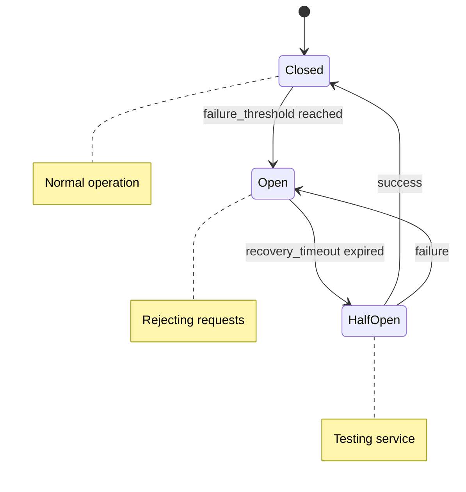

# Error Handling

!!! warning "Production Resilience"
    JAF's error handling framework provides comprehensive resilience patterns including circuit breakers, exponential backoff retries, and graceful degradation to ensure production systems remain stable under failure conditions.

## 🎯 Overview

The JAF error handling system implements enterprise-grade resilience patterns:

- **🔄 Circuit Breaker Pattern**: Prevents cascade failures
- **⚡ Retry Logic**: Exponential backoff with jitter
- **🛡️ Graceful Degradation**: Fallback mechanisms
- **📊 Error Monitoring**: Comprehensive error tracking
- **🎯 Context-Aware Recovery**: Smart error classification

## 🏗️ Error Hierarchy

### ADK Error Types

```python
from adk.errors import (
    AdkError,           # Base error class
    AdkLLMError,        # LLM service errors
    AdkSessionError,    # Session management errors
    AdkSecurityError,   # Security-related errors
    AdkConfigError,     # Configuration errors
    AdkTimeoutError,    # Timeout errors
    AdkRateLimitError   # Rate limiting errors
)

# Error hierarchy visualization
AdkError
├── AdkLLMError
│   ├── LLMTimeoutError
│   ├── LLMRateLimitError
│   └── LLMAuthenticationError
├── AdkSessionError
│   ├── SessionNotFoundError
│   └── SessionExpiredError
├── AdkSecurityError
│   ├── AuthenticationError
│   └── AuthorizationError
└── AdkConfigError
    ├── InvalidConfigError
    └── MissingConfigError
```

### Error Context and Metadata

```python
from adk.errors import create_adk_error

# Rich error context
error = create_adk_error(
    error_type=AdkLLMError,
    message="LLM service timeout",
    context={
        "service": "openai",
        "model": "gpt-4",
        "request_id": "req_123",
        "timeout_seconds": 30,
        "retry_count": 2
    },
    recoverable=True,
    retry_after_seconds=60
)

print(f"Error: {error.message}")
print(f"Context: {error.context}")
print(f"Recoverable: {error.recoverable}")
print(f"Retry after: {error.retry_after_seconds}s")
```

## 🔄 Circuit Breaker Pattern

### Basic Circuit Breaker

```python
from adk.errors import create_circuit_breaker, CircuitBreakerError

# Create circuit breaker for LLM service
llm_circuit_breaker = create_circuit_breaker(
    name="llm-service",
    failure_threshold=3,        # Open after 3 failures
    recovery_timeout=60,        # Stay open for 60 seconds
    expected_exception=AdkLLMError
)

@llm_circuit_breaker
async def call_llm_service(prompt: str) -> str:
    """LLM service call protected by circuit breaker."""
    # This function is automatically protected
    response = await llm_service.complete(prompt)
    return response.content

# Usage
try:
    result = await call_llm_service("Hello, world!")
    print(f"Success: {result}")
except CircuitBreakerError:
    print("Circuit breaker is open - service unavailable")
except AdkLLMError as e:
    print(f"LLM error: {e}")
```

### Circuit Breaker States



### Advanced Circuit Breaker Configuration

```python
from adk.errors import CircuitBreakerConfig, create_circuit_breaker

# Advanced configuration
config = CircuitBreakerConfig(
    failure_threshold=5,           # More tolerant
    recovery_timeout=120,          # Longer recovery time
    success_threshold=2,           # Require 2 successes to close
    timeout=30,                    # Call timeout
    expected_exception=(AdkLLMError, AdkTimeoutError),
    fallback_function=llm_fallback_response
)

circuit_breaker = create_circuit_breaker("advanced-llm", config)

async def llm_fallback_response(prompt: str) -> str:
    """Fallback response when service is unavailable."""
    return "I'm currently experiencing technical difficulties. Please try again later."
```

## ⚡ Retry Logic

### Exponential Backoff Retry

```python
from adk.errors import create_retry_handler, RetryConfig

# Create retry handler with exponential backoff
retry_handler = create_retry_handler(
    max_attempts=3,
    base_delay=1.0,              # Start with 1 second
    exponential_base=2.0,        # Double each time
    max_delay=30.0,              # Cap at 30 seconds
    jitter=True                  # Add randomness
)

@retry_handler
async def unreliable_operation():
    """Operation that might fail and should be retried."""
    if random.random() < 0.7:  # 70% failure rate
        raise AdkLLMError("Temporary service error")
    return "Success!"

# Usage
try:
    result = await unreliable_operation()
    print(f"Operation succeeded: {result}")
except AdkLLMError as e:
    print(f"Operation failed after all retries: {e}")
```

### Conditional Retry Logic

```python
from adk.errors import RetryConfig, should_retry

def custom_retry_condition(exception: Exception, attempt: int) -> bool:
    """Custom logic for when to retry."""
    # Don't retry authentication errors
    if isinstance(exception, AdkSecurityError):
        return False
    
    # Retry rate limit errors with longer delay
    if isinstance(exception, AdkRateLimitError):
        return attempt <= 5
    
    # Retry other errors up to 3 times
    return attempt <= 3

retry_config = RetryConfig(
    max_attempts=5,
    retry_condition=custom_retry_condition,
    delay_calculator=lambda attempt: min(2 ** attempt, 60)  # Exponential with cap
)

retry_handler = create_retry_handler(retry_config)
```

### Retry with Context

```python
@retry_handler
async def context_aware_operation(context: dict):
    """Operation with retry context tracking."""
    try:
        return await external_service_call(context)
    except Exception as e:
        # Add context to error for debugging
        enriched_error = create_adk_error(
            error_type=type(e),
            message=str(e),
            context={
                **context,
                "operation": "external_service_call",
                "timestamp": datetime.now().isoformat()
            }
        )
        raise enriched_error
```

## 🛡️ Graceful Degradation

### Fallback Mechanisms

```python
from adk.errors import with_fallback

@with_fallback(fallback_function=lambda: "Fallback response")
async def primary_operation():
    """Primary operation with fallback."""
    # Try primary service
    return await primary_service.call()

# If primary_operation fails, fallback_function is called automatically
result = await primary_operation()  # Returns either primary result or fallback
```

### Multi-Level Fallbacks

```python
from adk.errors import FallbackChain

# Create fallback chain
fallback_chain = FallbackChain([
    ("primary", primary_llm_service),
    ("secondary", secondary_llm_service),
    ("cache", cached_response_service),
    ("static", lambda prompt: "I'm currently unavailable. Please try again later.")
])

async def resilient_llm_call(prompt: str) -> str:
    """LLM call with multiple fallbacks."""
    return await fallback_chain.execute(prompt)
```

### Service Health Checking

```python
from adk.errors import HealthChecker, ServiceStatus

class LLMHealthChecker(HealthChecker):
    """Health checker for LLM service."""
    
    async def check_health(self) -> ServiceStatus:
        try:
            # Quick health check call
            response = await self.service.health_check()
            return ServiceStatus.HEALTHY if response.ok else ServiceStatus.DEGRADED
        except Exception:
            return ServiceStatus.UNHEALTHY

health_checker = LLMHealthChecker(llm_service)

# Use health status to determine behavior
if await health_checker.is_healthy():
    result = await normal_operation()
else:
    result = await fallback_operation()
```

## 📊 Error Monitoring and Observability

### Error Metrics Collection

```python
from adk.errors import ErrorMetrics, create_error_handler

# Initialize error metrics
error_metrics = ErrorMetrics()

error_handler = create_error_handler(
    metrics_collector=error_metrics,
    enable_tracing=True,
    log_level="INFO"
)

@error_handler
async def monitored_operation():
    """Operation with comprehensive error monitoring."""
    try:
        return await risky_operation()
    except AdkLLMError:
        # Automatically tracked in metrics
        raise

# View error statistics
stats = error_metrics.get_stats()
print(f"Total errors: {stats['total_errors']}")
print(f"Error rate: {stats['error_rate']:.2%}")
print(f"Most common error: {stats['most_common_error']}")
```

### Structured Error Logging

```python
from adk.errors import ErrorLogger
import structlog

# Configure structured logging
error_logger = ErrorLogger(
    logger=structlog.get_logger(),
    include_stack_trace=True,
    include_context=True,
    sensitive_fields=["api_key", "password", "token"]
)

async def logged_operation():
    """Operation with structured error logging."""
    try:
        return await operation_that_might_fail()
    except Exception as e:
        await error_logger.log_error(
            error=e,
            context={
                "user_id": "user-123",
                "operation": "llm_call",
                "request_id": "req-456"
            },
            severity="high"
        )
        raise
```

### Error Alerting

```python
from adk.errors import ErrorAlerter, AlertConfig

# Configure error alerting
alert_config = AlertConfig(
    error_threshold=10,           # Alert after 10 errors
    time_window_minutes=5,        # Within 5 minutes
    cooldown_minutes=15,          # Wait 15 minutes between alerts
    alert_channels=["email", "slack"]
)

error_alerter = ErrorAlerter(alert_config)

@error_alerter.monitor
async def critical_operation():
    """Critical operation with automatic alerting."""
    return await important_service_call()
```

## 🔧 Error Recovery Strategies

### Automatic Recovery

```python
from adk.errors import AutoRecoveryHandler

recovery_handler = AutoRecoveryHandler({
    AdkLLMError: "retry_with_backoff",
    AdkRateLimitError: "wait_and_retry",
    AdkTimeoutError: "increase_timeout_and_retry",
    AdkSessionError: "refresh_session_and_retry"
})

@recovery_handler
async def self_healing_operation():
    """Operation that attempts automatic recovery."""
    return await operation_with_auto_recovery()
```

### Manual Recovery Triggers

```python
from adk.errors import RecoveryManager

recovery_manager = RecoveryManager()

# Register recovery procedures
@recovery_manager.register_recovery(AdkLLMError)
async def recover_from_llm_error(error: AdkLLMError, context: dict):
    """Manual recovery from LLM errors."""
    if "rate_limit" in error.message.lower():
        await asyncio.sleep(error.retry_after_seconds)
        return await retry_operation(context)
    elif "timeout" in error.message.lower():
        return await retry_with_longer_timeout(context)
    else:
        return await use_fallback_service(context)

# Trigger recovery
try:
    result = await risky_operation()
except AdkLLMError as e:
    result = await recovery_manager.recover(e, context)
```

## 🧪 Testing Error Handling

### Error Injection for Testing

```python
from adk.errors.testing import ErrorInjector, ErrorScenario

# Create error scenarios for testing
error_injector = ErrorInjector([
    ErrorScenario(
        name="llm_timeout",
        error_type=AdkTimeoutError,
        probability=0.1,  # 10% chance
        condition=lambda context: context.get("model") == "gpt-4"
    ),
    ErrorScenario(
        name="rate_limit",
        error_type=AdkRateLimitError,
        probability=0.05,  # 5% chance
        retry_after=60
    )
])

# Inject errors in test environment
@error_injector.inject_errors
async def test_operation():
    """Operation with error injection for testing."""
    return await llm_service.call()

# Run tests
async def test_error_handling():
    for _ in range(100):
        try:
            await test_operation()
        except AdkError as e:
            print(f"Handled error: {type(e).__name__}")
```

### Chaos Engineering

```python
from adk.errors.chaos import ChaosMonkey

# Configure chaos testing
chaos_monkey = ChaosMonkey({
    "network_delay": {"probability": 0.1, "delay_ms": 1000},
    "service_unavailable": {"probability": 0.05, "duration_seconds": 30},
    "partial_failure": {"probability": 0.15, "success_rate": 0.7}
})

@chaos_monkey.apply_chaos
async def chaos_tested_operation():
    """Operation tested with chaos engineering."""
    return await production_operation()
```

## 📈 Best Practices

### 1. Error Classification

```python
def classify_error(error: Exception) -> str:
    """Classify errors for appropriate handling."""
    if isinstance(error, AdkSecurityError):
        return "security"  # Don't retry, alert immediately
    elif isinstance(error, AdkRateLimitError):
        return "rate_limit"  # Retry with delay
    elif isinstance(error, AdkTimeoutError):
        return "timeout"  # Retry with increased timeout
    elif isinstance(error, AdkConfigError):
        return "config"  # Fix configuration, don't retry
    else:
        return "unknown"  # Default handling
```

### 2. Error Budgets

```python
from adk.errors import ErrorBudget

# Define error budget for service
error_budget = ErrorBudget(
    budget_percentage=0.1,        # 0.1% error rate allowed
    time_window_hours=24,         # Over 24 hours
    action_on_exceeded="alert"    # Alert when exceeded
)

@error_budget.track
async def budget_tracked_operation():
    """Operation tracked against error budget."""
    return await service_call()
```

### 3. Graceful Shutdown

```python
from adk.errors import GracefulShutdownHandler

shutdown_handler = GracefulShutdownHandler(
    max_shutdown_time=30,     # 30 seconds to graceful shutdown
    save_state=True,          # Save state before shutdown
    notify_clients=True       # Notify clients of shutdown
)

@shutdown_handler.on_shutdown
async def cleanup_resources():
    """Cleanup resources during graceful shutdown."""
    await close_database_connections()
    await save_pending_operations()
    await notify_monitoring_systems()
```

## 🔗 Integration with JAF Core

### Session Error Handling

```python
from adk.types import ImmutableAdkSession
from adk.errors import SessionErrorHandler

session_error_handler = SessionErrorHandler()

@session_error_handler
async def safe_session_operation(session: ImmutableAdkSession):
    """Session operation with error handling."""
    try:
        return await process_session(session)
    except AdkSessionError:
        # Automatically handled by decorator
        raise
```

### Tool Error Handling

```python
from adk.errors import ToolErrorHandler

tool_error_handler = ToolErrorHandler(
    timeout_seconds=30,
    retry_attempts=2,
    fallback_response="Tool temporarily unavailable"
)

@tool_error_handler
async def safe_tool_execution(tool_call):
    """Tool execution with comprehensive error handling."""
    return await execute_tool(tool_call)
```

## 🔗 Related Documentation

- **[ADK Overview](adk-overview.md)** - Complete ADK framework introduction
- **[Security Framework](security-framework.md)** - Security and error prevention
- **[Session Management](session-management.md)** - Error-safe session handling
- **[Validation Suite](validation-suite.md)** - Testing error handling code

---

!!! success "Production Resilience"
    JAF's error handling framework provides enterprise-grade resilience with circuit breakers, intelligent retries, and comprehensive monitoring. The system gracefully handles failures and maintains service availability under adverse conditions.