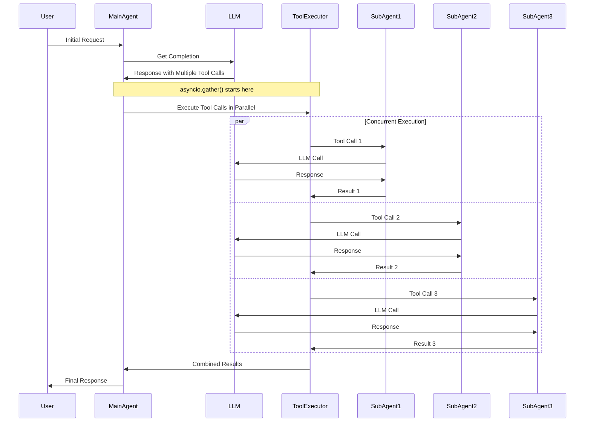

# Parallel Agent Execution in JAF

JAF provides comprehensive parallel agent execution capabilities, enabling efficient coordination of multiple agents with sophisticated execution patterns, result aggregation, and error handling.

## Table of Contents

1. [Architecture Overview](#architecture-overview)
2. [Core Concepts](#core-concepts)
3. [Parallel Agent Groups](#parallel-agent-groups)
4. [Result Aggregation Strategies](#result-aggregation-strategies)
5. [Quick Start Guide](#quick-start-guide)
6. [Advanced Configuration](#advanced-configuration)
7. [API Reference](#api-reference)
8. [Examples](#examples)
9. [Performance Considerations](#performance-considerations)
10. [Best Practices](#best-practices)

## Architecture Overview

### Single Event Loop Design

JAF uses a **single asyncio event loop** architecture with cooperative concurrency:

```mermaid
graph TB
    subgraph "Single asyncio Event Loop"
        MainAgent[Main Agent Turn Loop]
        ToolExec[Tool Executor<br/>asyncio.gather()]
        SubA1[Sub-Agent 1<br/>Recursive run()]
        SubA2[Sub-Agent 2<br/>Recursive run()]
        SubA3[Sub-Agent 3<br/>Recursive run()]
        LLMProvider[LLM Provider<br/>Shared Resource]
        Memory[Memory Provider<br/>Shared Resource]
    end
    
    MainAgent -->|Multiple Tool Calls| ToolExec
    ToolExec -.->|Concurrent| SubA1
    ToolExec -.->|Concurrent| SubA2
    ToolExec -.->|Concurrent| SubA3
    
    SubA1 <-->|await| LLMProvider
    SubA2 <-->|await| LLMProvider
    SubA3 <-->|await| LLMProvider
    
    SubA1 <-->|await| Memory
    SubA2 <-->|await| Memory
    SubA3 <-->|await| Memory
    
    SubA1 -->|Result| ToolExec
    SubA2 -->|Result| ToolExec
    SubA3 -->|Result| ToolExec
    ToolExec -->|Combined Results| MainAgent
```

### Key Characteristics

- **No Separate While Loops**: Each agent doesn't have its own execution loop
- **Cooperative Concurrency**: Agents yield control during I/O operations (LLM calls)
- **Tool-Level Parallelism**: `asyncio.gather()` enables concurrent tool execution
- **Shared Resources**: All agents share the same LLM provider and memory
- **Recursive Execution**: Sub-agents call `engine.run()` recursively in the same event loop

### Execution Flow



## Core Concepts

### 1. Parallel Agent Groups

Groups of agents configured to execute together with shared execution parameters:

```python
from jaf.core.parallel_agents import ParallelAgentGroup

group = ParallelAgentGroup(
    name="language_specialists",
    agents=[spanish_agent, french_agent, german_agent],
    shared_input=True,                    # All agents receive same input
    result_aggregation="combine",         # How to combine results
    timeout=30.0,                        # Group execution timeout
    metadata={"type": "translation"}     # Optional metadata
)
```

### 2. Execution Modes

- **Sequential Groups**: Groups execute one after another
- **Parallel Groups**: All groups execute simultaneously
- **Mixed Mode**: Combine sequential and parallel execution patterns

### 3. Result Aggregation

Intelligent combination of results from parallel agent executions:

- **`"combine"`**: Merge all successful results
- **`"first"`**: Return first successful result
- **`"majority"`**: Return result if majority succeeds
- **`"custom"`**: Use custom aggregation function

## Parallel Agent Groups

### Creating Agent Groups

```python
from jaf.core.parallel_agents import ParallelAgentGroup
from jaf import Agent

# Create specialized agents
spanish_agent = Agent(
    name='spanish_translator',
    instructions=lambda state: 'Translate to Spanish and respond in Spanish only.',
    tools=[]
)

french_agent = Agent(
    name='french_translator',
    instructions=lambda state: 'Translate to French and respond in French only.',
    tools=[]
)

# Create parallel group
translation_group = ParallelAgentGroup(
    name="translators",
    agents=[spanish_agent, french_agent],
    shared_input=True,
    result_aggregation="combine",
    timeout=25.0,
    metadata={
        "category": "translation",
        "languages": ["spanish", "french"]
    }
)
```

### Group Configuration Options

| Parameter | Type | Description | Default |
|-----------|------|-------------|---------|
| `name` | `str` | Unique identifier for the group | Required |
| `agents` | `List[Agent]` | Agents to execute in parallel | Required |
| `shared_input` | `bool` | Whether all agents receive same input | `True` |
| `result_aggregation` | `str` | Aggregation strategy | `"combine"` |
| `timeout` | `Optional[float]` | Group execution timeout in seconds | `None` |
| `custom_aggregator` | `Optional[Callable]` | Custom aggregation function | `None` |
| `metadata` | `Optional[Dict]` | Additional group metadata | `None` |

## Result Aggregation Strategies

### 1. Combine Strategy (Default)

Combines all successful results into a structured format:

```python
# Configuration
group = ParallelAgentGroup(
    name="analysts",
    agents=[tech_agent, business_agent, creative_agent],
    result_aggregation="combine"
)

# Example Output
{
    "combined_results": [
        "Technical analysis: System architecture looks solid...",
        "Business analysis: Market opportunity is significant...",
        "Creative analysis: User experience could be enhanced..."
    ],
    "result_count": 3
}
```

**Use Cases**: When you need all perspectives and can handle multiple results.

### 2. First Strategy

Returns the first successful result only:

```python
group = ParallelAgentGroup(
    name="quick_response",
    agents=[fast_agent, medium_agent, slow_agent],
    result_aggregation="first"
)

# Example Output (first successful result)
"Quick analysis completed in 2.3 seconds with high confidence."
```

**Use Cases**: When any agent's result is sufficient and speed is priority.

### 3. Majority Strategy

Returns result only if majority of agents succeed:

```python
group = ParallelAgentGroup(
    name="consensus_team",
    agents=[agent1, agent2, agent3, agent4, agent5],  # 5 agents
    result_aggregation="majority"
)

# Example Output (3+ out of 5 succeed)
"Consensus reached: Recommended approach is cloud-native architecture."

# Example Output (insufficient majority)
{
    "error": "no_majority",
    "results": ["Result 1", "Result 2"],  # Only 2 out of 5 succeeded
    "message": "Insufficient consensus reached"
}
```

**Use Cases**: When you need confidence through consensus or reliability is critical.

### 4. Custom Strategy

Uses a custom function for sophisticated aggregation:

```python
def consensus_aggregator(results):
    """Custom aggregator that analyzes consensus patterns."""
    if len(results) < 2:
        return {"type": "single_result", "result": results[0] if results else "No results"}
    
    # Analyze for common themes
    themes = {}
    for result in results:
        if "recommend" in result.lower():
            themes["recommendation"] = themes.get("recommendation", 0) + 1
        if "concern" in result.lower():
            themes["concern"] = themes.get("concern", 0) + 1
    
    consensus_strength = max(themes.values()) / len(results) if themes else 0
    
    return {
        "type": "consensus_analysis",
        "agent_count": len(results),
        "themes": themes,
        "consensus_strength": consensus_strength,
        "all_results": results,
        "summary": f"Strong consensus ({consensus_strength:.1%})" if consensus_strength > 0.7 else "Weak consensus"
    }

group = ParallelAgentGroup(
    name="consensus_team",
    agents=[agent1, agent2, agent3],
    result_aggregation="custom",
    custom_aggregator=consensus_aggregator
)
```

**Use Cases**: Domain-specific analysis, consensus detection, or sophisticated result processing.

## Quick Start Guide

### 1. Simple Parallel Execution

```python
from jaf import Agent
from jaf.core.parallel_agents import create_simple_parallel_tool

# Create agents
math_agent = Agent(name='math_expert', instructions=lambda s: 'Solve math problems', tools=[])
science_agent = Agent(name='science_expert', instructions=lambda s: 'Explain science', tools=[])

# Create parallel tool (one line!)
parallel_tool = create_simple_parallel_tool(
    agents=[math_agent, science_agent],
    group_name="experts",
    tool_name="consult_experts",
    shared_input=True,
    result_aggregation="combine",
    timeout=30.0
)

# Use in orchestrator
orchestrator = Agent(
    name='orchestrator',
    instructions=lambda s: 'Use consult_experts for multi-expert analysis',
    tools=[parallel_tool]
)
```

### 2. Language Specialists Pattern

```python
from jaf.core.parallel_agents import create_language_specialists_tool

# Create language agents
spanish_agent = Agent(name='spanish', instructions=lambda s: 'Respond in Spanish', tools=[])
french_agent = Agent(name='french', instructions=lambda s: 'Respond in French', tools=[])

# Create language tool
language_tool = create_language_specialists_tool(
    language_agents={
        "spanish": spanish_agent,
        "french": french_agent,
    },
    tool_name="translate_parallel",
    timeout=25.0
)
```

### 3. Domain Experts Pattern

```python
from jaf.core.parallel_agents import create_domain_experts_tool

# Create expert agents
tech_agent = Agent(name='tech', instructions=lambda s: 'Technical advice', tools=[])
business_agent = Agent(name='business', instructions=lambda s: 'Business strategy', tools=[])

# Create experts tool
experts_tool = create_domain_experts_tool(
    expert_agents={
        "tech": tech_agent,
        "business": business_agent,
    },
    tool_name="consult_experts",
    result_aggregation="combine",
    timeout=60.0
)
```

## Advanced Configuration

### Multi-Group Parallel Execution

Execute multiple groups with different strategies:

```python
from jaf.core.parallel_agents import ParallelAgentGroup, create_parallel_agents_tool

# Define multiple groups
rapid_response = ParallelAgentGroup(
    name="rapid_response",
    agents=[tech_agent, creative_agent],
    result_aggregation="first",
    timeout=15.0,
    metadata={"priority": "high"}
)

analysis_team = ParallelAgentGroup(
    name="analysis_team",
    agents=[business_agent, legal_agent],
    result_aggregation="combine",
    timeout=30.0,
    metadata={"priority": "medium"}
)

comprehensive_tool = create_parallel_agents_tool(
    groups=[rapid_response, analysis_team],
    tool_name="multi_team_analysis",
    inter_group_execution="parallel",  # Execute groups in parallel
    global_timeout=60.0,
    preserve_session=False
)
```

### Custom Execution Configuration

```python
from jaf.core.parallel_agents import ParallelExecutionConfig

config = ParallelExecutionConfig(
    groups=[rapid_response, analysis_team],
    inter_group_execution="sequential",  # or "parallel"
    global_timeout=120.0,
    preserve_session=True  # Share session across agent calls
)
```

### Error Handling Configuration

```python
def resilient_aggregator(results):
    """Aggregator that handles partial failures gracefully."""
    if not results:
        return {"status": "all_failed", "fallback": "Using cached analysis"}
    
    if len(results) == 1:
        return {"status": "partial_success", "result": results[0]}
    
    # Combine successful results
    combined = {
        "status": "success",
        "primary_result": results[0],
        "supporting_results": results[1:],
        "confidence": len(results) / 3  # Assuming 3 total agents
    }
    
    return combined

resilient_group = ParallelAgentGroup(
    name="resilient_analysts",
    agents=[primary_agent, secondary_agent, backup_agent],
    result_aggregation="custom",
    custom_aggregator=resilient_aggregator,
    timeout=45.0
)
```

## API Reference

### Core Classes

#### `ParallelAgentGroup`

```python
@dataclass
class ParallelAgentGroup:
    name: str
    agents: List[Agent[Ctx, Out]]
    shared_input: bool = True
    result_aggregation: str = "combine"  # "combine", "first", "majority", "custom"
    custom_aggregator: Optional[Callable[[List[str]], str]] = None
    timeout: Optional[float] = None
    metadata: Optional[Dict[str, Any]] = None
```

#### `ParallelExecutionConfig`

```python
@dataclass
class ParallelExecutionConfig:
    groups: List[ParallelAgentGroup]
    inter_group_execution: str = "sequential"  # "sequential" or "parallel"
    global_timeout: Optional[float] = None
    preserve_session: bool = False
```

### Convenience Functions

#### `create_simple_parallel_tool()`

```python
def create_simple_parallel_tool(
    agents: List[Agent],
    group_name: str = "parallel_group",
    tool_name: str = "execute_parallel_agents",
    shared_input: bool = True,
    result_aggregation: str = "combine",
    timeout: Optional[float] = None
) -> Tool
```

Creates a simple parallel tool from a list of agents.

#### `create_language_specialists_tool()`

```python
def create_language_specialists_tool(
    language_agents: Dict[str, Agent],
    tool_name: str = "consult_language_specialists",
    timeout: Optional[float] = 30.0
) -> Tool
```

Creates a tool that consults multiple language specialists in parallel.

#### `create_domain_experts_tool()`

```python
def create_domain_experts_tool(
    expert_agents: Dict[str, Agent],
    tool_name: str = "consult_domain_experts",
    result_aggregation: str = "combine",
    timeout: Optional[float] = 60.0
) -> Tool
```

Creates a tool that consults multiple domain experts in parallel.

#### `create_parallel_agents_tool()`

```python
def create_parallel_agents_tool(
    groups: List[ParallelAgentGroup],
    tool_name: str = "execute_parallel_agents",
    tool_description: str = "Execute multiple agents in parallel groups",
    inter_group_execution: str = "sequential",
    global_timeout: Optional[float] = None,
    preserve_session: bool = False
) -> Tool
```

Creates an advanced parallel agents tool with multiple groups.

## Examples

### Example 1: Multi-Language Translation Service

```python
import asyncio
from jaf import Agent, make_litellm_provider
from jaf.core.parallel_agents import create_language_specialists_tool
from jaf.core.types import RunState, RunConfig, Message, generate_run_id, generate_trace_id

# Create language specialists
spanish_agent = Agent(
    name='spanish_specialist',
    instructions=lambda state: 'Traduce al español y responde solo en español.',
    tools=[]
)

french_agent = Agent(
    name='french_specialist',
    instructions=lambda state: 'Traduis en français et réponds seulement en français.',
    tools=[]
)

german_agent = Agent(
    name='german_specialist',
    instructions=lambda state: 'Übersetze ins Deutsche und antworte nur auf Deutsch.',
    tools=[]
)

# Create parallel language tool
language_tool = create_language_specialists_tool(
    language_agents={
        "spanish": spanish_agent,
        "french": french_agent,
        "german": german_agent
    },
    tool_name="translate_to_multiple_languages",
    timeout=30.0
)

# Create orchestrator
orchestrator = Agent(
    name='translation_orchestrator',
    instructions=lambda state: '''You coordinate multiple language specialists.
    
When given text to translate:
1. Use translate_to_multiple_languages to get translations in all supported languages
2. Present the translations in a clear, organized format
3. Explain any cultural nuances or translation challenges
    
Always use the parallel translation tool to provide comprehensive multilingual support.''',
    tools=[language_tool]
)

async def run_translation_demo():
    """Demo the parallel translation service."""
    # Setup (you'll need to configure your LLM provider)
    model_provider = make_litellm_provider("your_base_url", "your_api_key")
    
    # Create agent registry
    agent_registry = {
        'translation_orchestrator': orchestrator,
        'spanish_specialist': spanish_agent,
        'french_specialist': french_agent,
        'german_specialist': german_agent
    }
    
    # Create run state
    initial_state = RunState(
        run_id=generate_run_id(),
        trace_id=generate_trace_id(),
        messages=[Message(
            role='user',
            content="Please translate 'Hello, how are you today? I hope you're having a wonderful day!' into multiple languages."
        )],
        current_agent_name='translation_orchestrator',
        context={},
        turn_count=0
    )
    
    # Create run config
    config = RunConfig(
        agent_registry=agent_registry,
        model_provider=model_provider,
        max_turns=3
    )
    
    # Execute
    result = await run(initial_state, config)
    
    print("Translation Results:")
    print("=" * 50)
    for message in result.final_state.messages:
        if message.role == 'assistant':
            print(message.content)
            print("-" * 30)

if __name__ == "__main__":
    asyncio.run(run_translation_demo())
```

### Example 2: Comprehensive Data Analysis Pipeline

```python
from jaf.core.parallel_agents import ParallelAgentGroup, create_parallel_agents_tool

# Create specialized analysis agents
data_validator = Agent(
    name='data_validator',
    instructions=lambda state: '''You are a data validation specialist.
    Analyze data for:
    - Missing values and inconsistencies
    - Data type issues
    - Outliers and anomalies
    - Quality scores and recommendations
    
    Provide a comprehensive data quality report.''',
    tools=[]
)

statistical_analyzer = Agent(
    name='statistical_analyzer',
    instructions=lambda state: '''You are a statistical analysis expert.
    Perform:
    - Descriptive statistics
    - Distribution analysis
    - Correlation analysis
    - Statistical significance tests
    
    Provide detailed statistical insights.''',
    tools=[]
)

business_analyst = Agent(
    name='business_analyst',
    instructions=lambda state: '''You are a business intelligence specialist.
    Focus on:
    - Business KPIs and metrics
    - Trend analysis
    - Strategic recommendations
    - ROI and impact analysis
    
    Provide business-focused insights.''',
    tools=[]
)

visualization_expert = Agent(
    name='visualization_expert',
    instructions=lambda state: '''You are a data visualization specialist.
    Recommend:
    - Appropriate chart types
    - Dashboard layouts
    - Interactive features
    - Visual storytelling approaches
    
    Provide visualization strategy.''',
    tools=[]
)

# Create analysis groups
core_analysis = ParallelAgentGroup(
    name="core_analysis",
    agents=[data_validator, statistical_analyzer],
    result_aggregation="combine",
    timeout=45.0,
    metadata={"priority": "high", "stage": "foundation"}
)

business_insights = ParallelAgentGroup(
    name="business_insights",
    agents=[business_analyst, visualization_expert],
    result_aggregation="combine",
    timeout=60.0,
    metadata={"priority": "medium", "stage": "insights"}
)

# Create comprehensive analysis tool
analysis_tool = create_parallel_agents_tool(
    groups=[core_analysis, business_insights],
    tool_name="comprehensive_data_analysis",
    tool_description="Perform comprehensive data analysis across multiple dimensions",
    inter_group_execution="sequential",  # Core first, then insights
    global_timeout=180.0
)

# Create main orchestrator
data_analysis_orchestrator = Agent(
    name='data_analysis_orchestrator',
    instructions=lambda state: '''You coordinate comprehensive data analysis.
    
For any data analysis request:
1. Use comprehensive_data_analysis to get insights from all specialists
2. Synthesize findings into a cohesive report
3. Highlight key findings and recommendations
4. Ensure both technical and business perspectives are covered
    
Provide a complete analysis that serves both technical and business stakeholders.''',
    tools=[analysis_tool]
)
```

### Example 3: Customer Service with Parallel Specialist Routing

```python
from jaf.core.parallel_agents import ParallelAgentGroup, create_parallel_agents_tool

# Create specialist agents
technical_support = Agent(
    name='technical_support',
    instructions=lambda state: '''You are a technical support specialist.
    Handle:
    - Technical troubleshooting
    - System configurations
    - Bug reports and fixes
    - Integration issues
    
    Provide detailed technical solutions.''',
    tools=[]
)

billing_support = Agent(
    name='billing_support',
    instructions=lambda state: '''You are a billing and payments specialist.
    Handle:
    - Payment issues
    - Subscription management
    - Refund requests
    - Pricing questions
    
    Provide clear billing assistance.''',
    tools=[]
)

product_expert = Agent(
    name='product_expert',
    instructions=lambda state: '''You are a product specialist.
    Handle:
    - Feature explanations
    - Usage guidance
    - Best practices
    - Product roadmap questions
    
    Provide comprehensive product insights.''',
    tools=[]
)

# Custom aggregator for customer service
def customer_service_aggregator(results):
    """Aggregate customer service responses intelligently."""
    if not results:
        return {"status": "no_response", "escalation_needed": True}
    
    # Categorize responses
    technical_responses = [r for r in results if "technical" in r.lower() or "system" in r.lower()]
    billing_responses = [r for r in results if "billing" in r.lower() or "payment" in r.lower()]
    product_responses = [r for r in results if "feature" in r.lower() or "product" in r.lower()]
    
    return {
        "status": "responses_available",
        "response_count": len(results),
        "technical_available": len(technical_responses) > 0,
        "billing_available": len(billing_responses) > 0,
        "product_available": len(product_responses) > 0,
        "all_responses": results,
        "primary_response": results[0],
        "response_summary": f"Received {len(results)} specialist responses covering multiple support areas."
    }

# Create intelligent routing group
support_specialists = ParallelAgentGroup(
    name="support_specialists",
    agents=[technical_support, billing_support, product_expert],
    result_aggregation="custom",
    custom_aggregator=customer_service_aggregator,
    timeout=60.0,
    metadata={"department": "customer_service"}
)

support_tool = create_parallel_agents_tool(
    groups=[support_specialists],
    tool_name="consult_support_specialists",
    tool_description="Get assistance from technical, billing, and product specialists",
    global_timeout=90.0
)

# Customer service orchestrator
customer_service_agent = Agent(
    name='customer_service_orchestrator',
    instructions=lambda state: '''You are a customer service coordinator.
    
For customer inquiries:
1. Use consult_support_specialists to get expert input
2. Analyze which specialists provided relevant responses
3. Synthesize the most helpful information
4. Provide a clear, friendly response to the customer
5. Escalate if no specialist could help adequately
    
Always prioritize customer satisfaction and clear communication.''',
    tools=[support_tool]
)
```

## Performance Considerations

### Execution Timing

Understanding the performance characteristics:

```
Sequential Execution:
Agent 1 → (30s) → Agent 2 → (30s) → Agent 3 → (30s)
Total: 90 seconds

Parallel Execution:
Agent 1 ┐
Agent 2 ├─ All execute simultaneously (30s)
Agent 3 ┘
Total: 30 seconds (67% time reduction)
```

### Resource Management

1. **Memory Usage**:
   - Each parallel agent maintains its own state
   - Consider memory usage with large numbers of agents
   - Use `preserve_session=False` for independent operations

2. **LLM Provider Limits**:
   - Respect rate limits and concurrent connection limits
   - Consider implementing backoff strategies
   - Monitor provider performance under parallel load

3. **Timeout Strategy**:
   - Set realistic timeouts based on agent complexity
   - Use shorter timeouts for quick operations
   - Consider cascade timeouts (group > global)

### Monitoring and Observability

```python
import time
from jaf.core.parallel_agents import create_simple_parallel_tool

# Add timing wrapper
def timed_parallel_tool(agents, **kwargs):
    tool = create_simple_parallel_tool(agents, **kwargs)
    
    original_execute = tool.execute
    
    async def timed_execute(args, context):
        start_time = time.time()
        result = await original_execute(args, context)
        end_time = time.time()
        
        print(f"Parallel execution completed in {end_time - start_time:.2f} seconds")
        return result
    
    tool.execute = timed_execute
    return tool
```

## Best Practices

### 1. Design for Parallelism

**✅ Do:**
```python
# Independent, stateless agents
data_validator = Agent(
    name="validator",
    instructions=lambda s: "Validate data independently",
    tools=[]
)

stats_analyzer = Agent(
    name="analyzer", 
    instructions=lambda s: "Analyze statistics independently",
    tools=[]
)
```

**❌ Don't:**
```python
# Agents that depend on each other's results
dependent_agent = Agent(
    name="dependent",
    instructions=lambda s: "Use results from the validator agent",  # ❌ Creates dependency
    tools=[]
)
```

### 2. Choose Appropriate Aggregation

| Use Case | Strategy | Rationale |
|----------|----------|-----------|
| Translation | `"combine"` | Want all languages |
| Quick response | `"first"` | Speed is priority |
| Consensus building | `"majority"` | Need agreement |
| Complex analysis | `"custom"` | Domain-specific logic |

### 3. Handle Errors Gracefully

```python
def resilient_aggregator(results):
    """Handle partial failures gracefully."""
    if not results:
        return {
            "status": "all_failed",
            "fallback_action": "Use cached results or escalate to human",
            "retry_recommended": True
        }
    
    if len(results) < len(expected_agents) / 2:
        return {
            "status": "insufficient_responses",
            "available_results": results,
            "confidence": "low",
            "recommendation": "Consider retry or escalation"
        }
    
    return {
        "status": "success",
        "results": results,
        "confidence": "high"
    }
```

### 4. Optimize Instructions

**✅ Good Instructions:**
```python
instructions = lambda s: '''You coordinate data analysis specialists.

When analyzing data:
1. Use analyze_data_parallel to get insights from ALL specialists simultaneously
2. Each specialist provides a different perspective (validation, statistics, business)
3. Synthesize all results into a comprehensive report
4. Highlight areas where specialists agree or disagree

Always use parallel analysis for thorough coverage.'''
```

**❌ Poor Instructions:**
```python
instructions = lambda s: "Analyze data using available tools"  # Too vague
```

### 5. Test Parallel Behavior

```python
async def test_parallel_execution():
    """Test that agents actually execute in parallel."""
    import time
    
    # Create test agents with artificial delays
    slow_agent = Agent(
        name="slow",
        instructions=lambda s: "Wait 5 seconds then respond",
        tools=[]
    )
    
    parallel_tool = create_simple_parallel_tool(
        agents=[slow_agent, slow_agent, slow_agent],  # 3 slow agents
        timeout=10.0
    )
    
    start_time = time.time()
    # Execute (should take ~5s in parallel, not 15s sequential)
    result = await parallel_tool.execute(
        AgentToolInput(input="test"), 
        context={}
    )
    end_time = time.time()
    
    execution_time = end_time - start_time
    print(f"Execution time: {execution_time:.1f}s")
    
    # Should be ~5s (parallel) not ~15s (sequential)
    assert execution_time < 8.0, f"Expected parallel execution, got {execution_time:.1f}s"
```

### 6. Production Considerations

1. **Fallback Strategies**:
   ```python
   config = ParallelExecutionConfig(
       groups=[primary_group],
       fallback_to_auto=True,  # Fall back to normal tool execution on failure
       max_retries=1
   )
   ```

2. **Monitoring**:
   ```python
   # Log parallel execution metrics
   import logging
   
   def log_parallel_results(group_name, results, execution_time):
       logging.info(f"Parallel group '{group_name}' completed in {execution_time:.2f}s")
       logging.info(f"Success rate: {len(results)}/{total_agents}")
   ```

3. **Resource Limits**:
   ```python
   # Limit concurrent executions
   MAX_PARALLEL_AGENTS = 5
   
   if len(agents) > MAX_PARALLEL_AGENTS:
       # Split into batches or use sequential execution
       pass
   ```

This comprehensive documentation covers all aspects of JAF's parallel agent execution system, from basic concepts to advanced production patterns. The system provides powerful capabilities for coordinating multiple agents efficiently while maintaining reliability and observability.